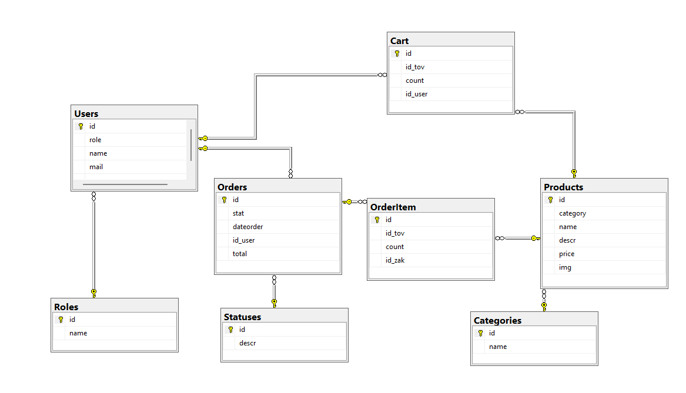
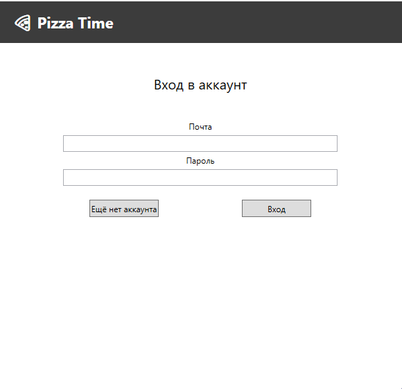
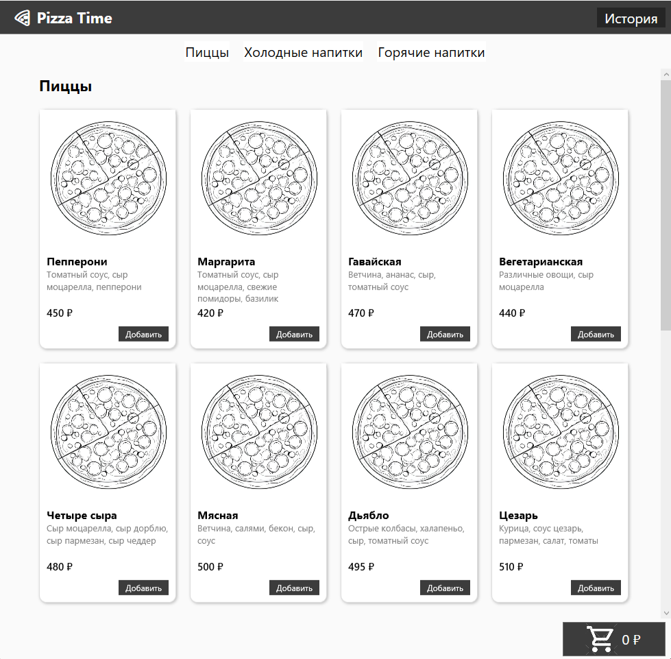
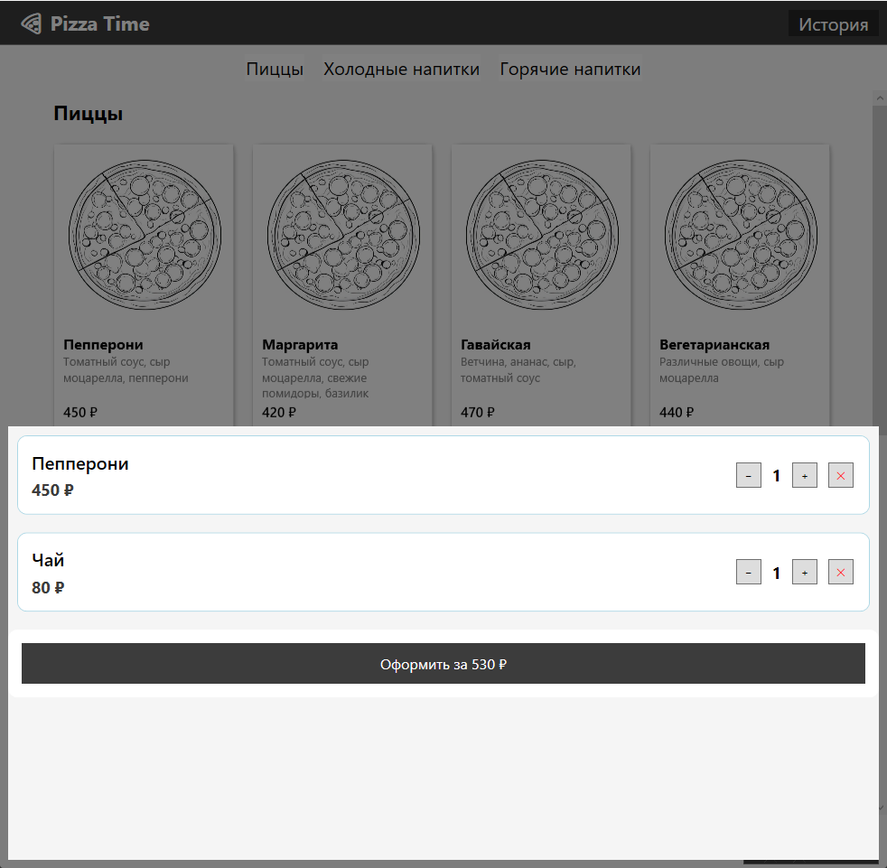
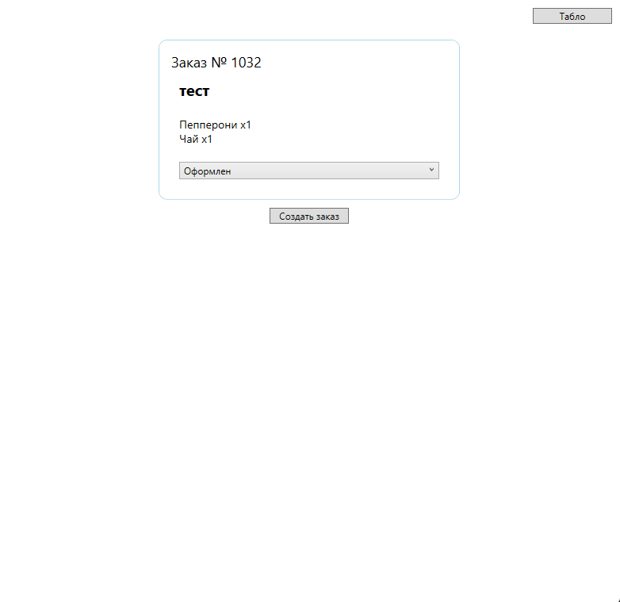
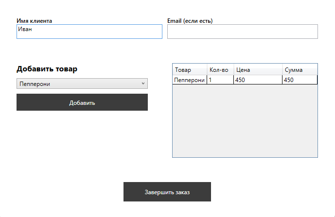

#PizzaApp

## Содержание

* [Описание проекта](#1-описание-проекта)
* [Стек проекта](#2-технологический-стек)
* [Инструкция по запуску](#3-инструкция-по-запуску)
* [Функционал и интерфейс](#4-функционал-и-интерфейс)

## 1. Описание проекта

PizzaApp — настольное приложение для автоматизации процесса оформления заказов в пиццерии.

Система предусматривает разделение ролей:

* Пользователь — просмотр каталога, добавление товаров в корзину, оформление заказа и просмотр истории заказов.
* Работник — создание заказов, контроль текущих заказов и работа с табло.

## 2. Технологический стек

* Язык программирования: C#

* Платформа: .NET

* UI-фреймворк: WPF

* ORM: Entity Framework (Database First)

* Работа с данными: LINQ to Entities

* СУБД: Microsoft SQL Server

## 3. Инструкция по запуску

Для корректной работы приложения необходимо:

1\. Установить Microsoft SQL Server 2021 или выше.

2\. Выполнить SQL-скрипт `/sql/init.sql` для создания и заполнения базы данных.

3\. В файле `App.config` изменить строку подключения, указав имя вашего сервера SQL Server:

  - параметр `data source`

  - при необходимости изменить имя базы данных (`initial catalog`)

4\. Запустить решение `PizzaApp.sln` в Visual Studio 2022 или напрямую - `PizzaApp/bin/Debug/PizzaApp.exe`

## 4. Функционал и интерфейс

### Структура базы данных

### Окно авторизации и регистрации

Позволяет пользователю зарегистрироваться или войти в систему под своей учетной записью

### Окно пользователя

* Просмотр каталога товаров
  

* Добавление заказа в корзину

* Просмотр корзины

  

* Оформление заказа

* Просмотр истории заказа  
  

  

### Окно работника

* Работа с активными заказами
 

  

* Создание нового заказа

  

* Отображение табло с активными заказами

  

